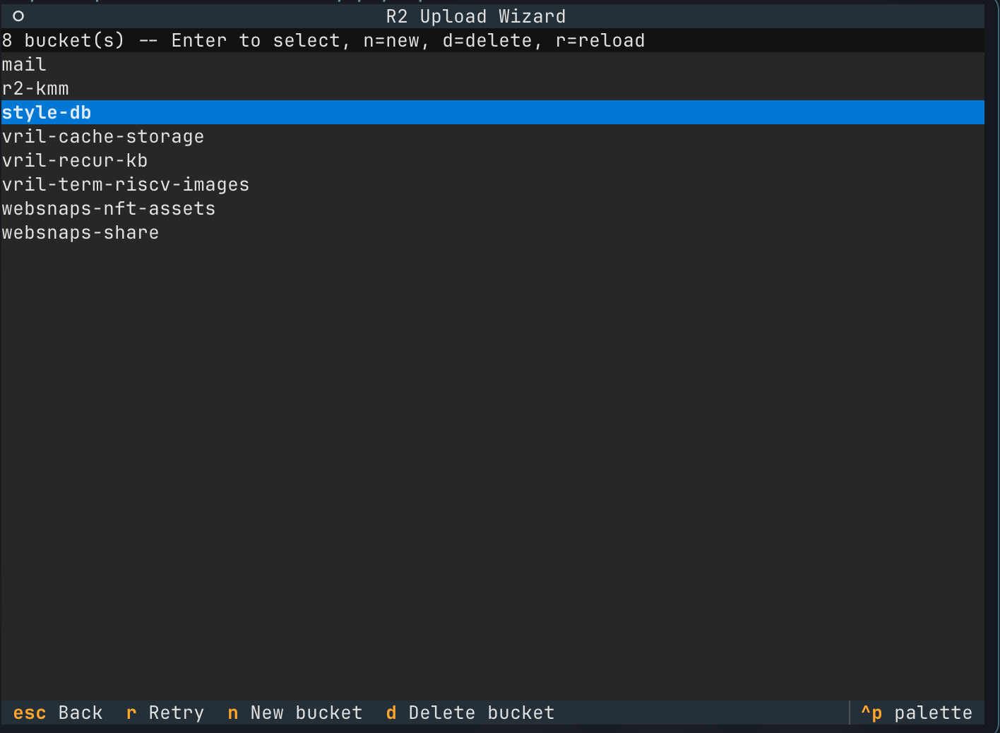
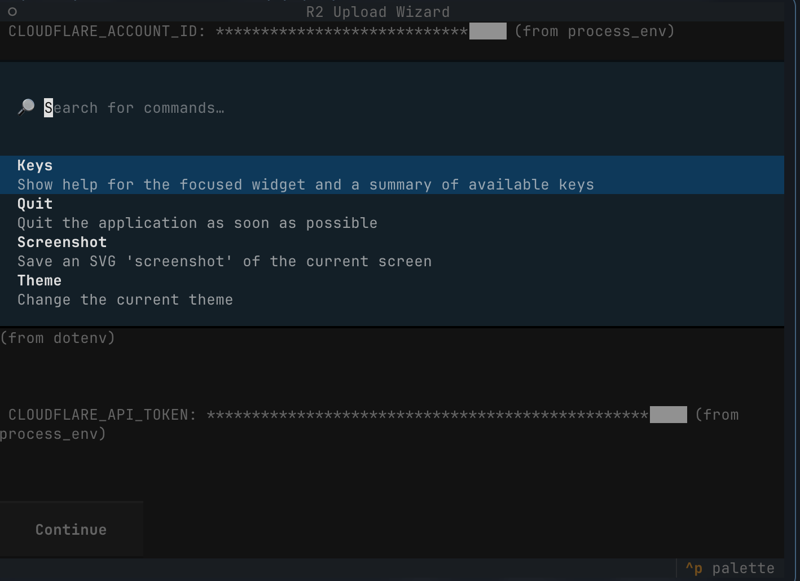
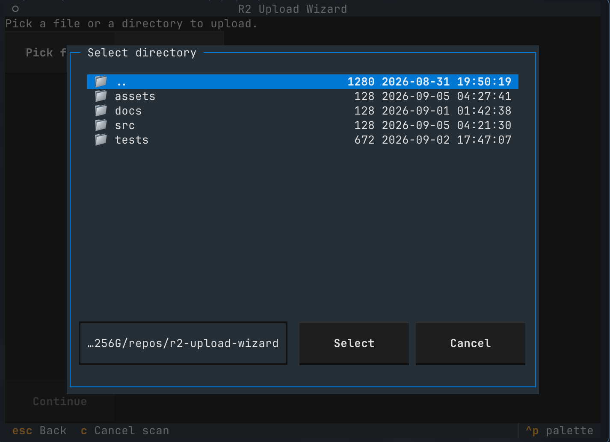

# R2 Upload Wizard

A polished, installable [Textual](https://textual.textualize.io/) terminal
wizard for uploading a single file or an entire directory tree to a
[Cloudflare R2](https://developers.cloudflare.com/r2/) bucket -- credential
setup, bucket create/select/delete, source picking, a full preview, live
progress, and a final summary, with no external binaries (no rclone/wrangler)
required.

This TUI was created to take the complexity out of uploading single or bulk files to Cloudflare R2 buckets. Additionally, existing solutions such as full GUI macOS or Windows apps are useful, however, many times they lock up when uploading large quantities of files. This upload wizard can handle the upload process for tens-of-thousands of files!

Tested and working when uploading ~15,000 files totaling ~5.5GB.

## Install

```bash
uv tool install .
# or
pipx install .
```

This installs the `r2-wizard` command.

## Quickstart

```bash
r2-wizard
```

On first run, the wizard checks for the 5 Cloudflare R2 environment
variables below. Any missing or invalid one gets an inline prompt right
there -- fill it in once and it's saved to `.env` in your current directory
for next time.

| Variable | Required | Purpose |
|---|---|---|
| `CLOUDFLARE_ACCOUNT_ID` | Yes | Your Cloudflare account ID |
| `CLOUDFLARE_ACCESS_KEY_ID` | Yes | R2 API token access key ID |
| `CLOUDFLARE_SECRET_ACCESS_KEY` | Yes | R2 API token secret |
| `CLOUDFLARE_S3_URL` | Yes | R2 S3-compatible endpoint, e.g. `https://<account id>.r2.cloudflarestorage.com` |
| `CLOUDFLARE_API_TOKEN` | Tracked, not yet used | Reserved for future Cloudflare-API-based features |

See `.env.example` for a template. Create an R2 API token and find your
account ID in the Cloudflare dashboard under **R2 > Manage R2 API Tokens**.

## Features

- **Bucket management**: list, create, and delete buckets straight from the
  wizard (delete requires typing the bucket name to confirm, and refuses to
  delete a non-empty bucket).
- **File or directory upload**: pick a single file, or a whole directory
  (relative paths are preserved as object keys).
- **Destination prefix**: optional path/prefix on the bucket, with a live
  preview of the resulting object keys.
- **Full preview before anything uploads**: source, file count, total size,
  destination, and (for directories) how many destination keys already
  exist, with a per-run choice to skip or overwrite them.
- **Live progress**: aggregate and per-file progress, cancelable mid-run.
- **Resilient batches**: one failed file never aborts the rest; the summary
  screen lists failures and can retry just those.

## Keyboard shortcuts

- `Escape` -- back a step
- `y` / `n` -- confirm / go back on the confirmation screen
- `r` -- retry loading buckets after an error
- `n` / `d` -- create / delete a bucket, from the bucket select screen

## Troubleshooting

- **"check your Access Key ID / Secret"**: the R2 API token's key pair is
  wrong or has been revoked -- fix it on the setup screen.
- **Bucket list fails with a connection error**: check `CLOUDFLARE_S3_URL`
  and your network.
- **Deleting a bucket is refused**: R2 (like S3) requires a bucket to be
  empty before it can be deleted; the wizard shows the object count and
  does not offer to auto-empty it.

## TUI Screenshots

Here are a few screenshots of the TUI for preview purposes:

<div align="center">

  

  <sub>Screenshot of R2 bucket list</sub>

  <br />

  

  <sub>Screenshot of in-TUI command palette</sub>

  <br />

  

  <sub>Screenshot of target upload selector</sub>

</div>

## Development

See `CONTRIBUTING.md`.

## License

VRIL LABS OSL v1.0 -- see `LICENSE`.
